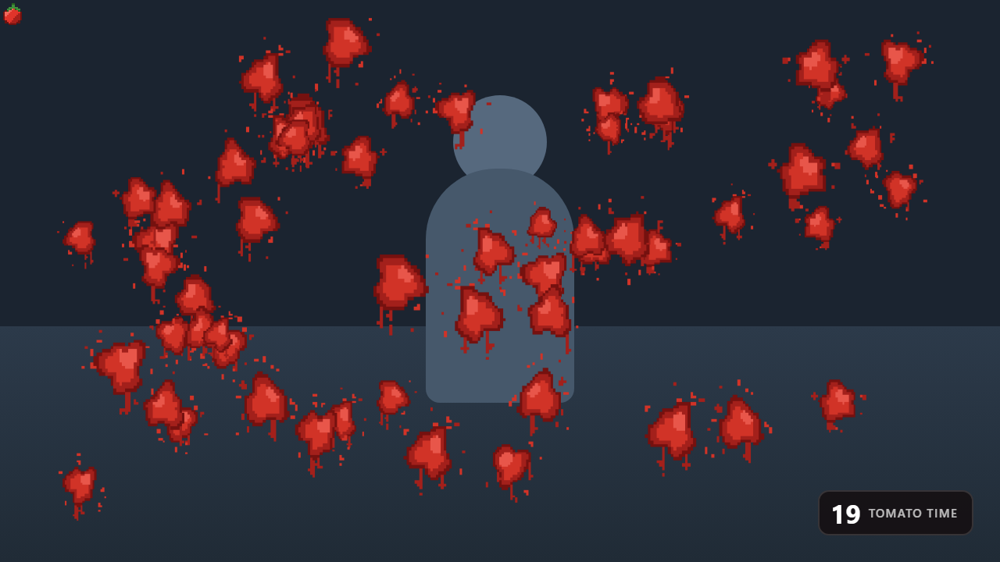

# 🍅 Tomato'd

Let Twitch chat throw tomatoes at you, live on stream.

A mod (or the broadcaster) types `!tomato`. A countdown appears in the corner, and for
the next 30 seconds anyone who types `TomatoTime` hurls a tomato from the viewer's side
of the screen at the streamer, where it splatters. Say it more than once in a message and
you throw one per repeat. A busy chat buries the shot. When the timer runs out, the screen
wipes clean.



## For the streamer

Add one **Browser Source** in OBS. That's the whole setup.

1. **Sources → + → Browser**
2. Paste your link, set **Width 1920**, **Height 1080**, click OK
3. Drag the layer to the top of your source list

No download, no login, no account to connect, nothing to install.

Get your link from the setup page, or use it directly:

```
https://abdullahmorrison.github.io/tomatod/overlay.html?channel=YOUR_CHANNEL
```

Only mods and the broadcaster can start a round — regular chatters can't.

`abdullahmorrison` can also start one on any channel without holding a badge (it's in
`DEFAULT_ALLOW` in `src/config.js`). Add more people with `&allow=name1,name2`, which
extends that list rather than replacing it.

## How it works

The page connects straight to Twitch chat over WebSocket using an anonymous `justinfan`
nickname. That needs no OAuth, no token and no bot account, which is what lets the whole
thing be a static site with no backend — free to host and nothing to keep running.

Moderator and broadcaster status arrive as tags on every chat message, so the `!tomato`
gate needs no API call. Note the broadcaster is *not* flagged `mod=1`, so both are
checked; otherwise the streamer couldn't trigger their own overlay. Logins in the
allow-list are matched case-insensitively against the sender's exact login, so a
lookalike name like `someone2` does not get in.

Everything is drawn in two stacked canvases:

- **Splatter layer.** Each splat is stamped once and then left alone, so a screen buried
  in splatter still costs nothing per frame. Cleared by the round-end wipe.
- **Tomato layer.** Cleared and redrawn each frame; airborne tomatoes only.

There is no cap on how many tomatoes can be in the air: if chat floods, all of it lands.
Landed tomatoes go onto a free list and are reused, so the pool grows to whatever the
busiest moment of a round needed and then stops allocating — a flood does not drag the
garbage collector into the middle of a round. The frame loop stops completely when
nothing is happening, since the source sits loaded for an entire stream and must cost
nothing between rounds.

The art is generated in code: a 16×16 pixel tomato and procedural pixel splats, drawn
upscaled with smoothing off. No image files, no CDN, nothing to fail mid-stream.

### The throw

The tomato travels *away* from the viewer, at the streamer. It enters large and close at
the bottom of the frame and shrinks as it recedes, along an arc, spinning. Depth is
derived from a notional distance closing at a constant rate, which gives the right
perspective falloff for free. Something landing high on screen is further away, so it
arrives smaller and leaves a smaller splat.

## Settings

All settings live in the overlay URL — the setup page writes them for you.

| Param | Default | Meaning |
|---|---|---|
| `channel` | *(required)* | Twitch channel to read |
| `duration` | `30` | Round length in seconds |
| `corner` | `bottom-right` | Timer position (`bottom-left`, `top-right`, `top-left`) |
| `word` | `TomatoTime` | Trigger text, matched case-insensitively as a whole word. One tomato per occurrence |
| `command` | `!tomato` | Command that starts a round |
| `cancel` | `!wipe` | Command that ends a round early and clears the screen |
| `maxInFlight` | *(unlimited)* | Optional cap on concurrent tomatoes. Set a number only if a machine can't keep up |
| `wipeMs` | `800` | Screen wipe duration at round end |
| `debug` | `off` | Status panel plus keyboard tests |
| `demo` | `off` | Runs a round by itself, to watch the effect without chat |
| `allow` | *(none)* | Extra logins that may start a round without being a mod, comma-separated |

A mod can also start a longer round with `!tomato 60`.

To end a round early and wipe the screen, type `!wipe` — or `!tomato stop`, which also
accepts `cancel`, `end`, `wipe` and `clear`. Anything still in the air fades out with
the splatter rather than vanishing mid-flight. Same permissions as starting a round.

## Development

```
node serve.js       # http://localhost:4747
npm test            # command parsing, config, round state, reconnect
```

No dependencies and no build step — the files in this repo are the deployed site. The
tests cover the pure logic and the round state machine; the visual layer is checked
with `debug=on` below.

With `debug=on`, the overlay shows live state and binds keys so the whole visual path
can be exercised with no chat and no mod:

| Key | Does |
|---|---|
| `R` | Start a round |
| `T` | Throw one tomato |
| `Y` | Throw 50 at once |

```
http://localhost:4747/overlay.html?channel=tenzinniznet&debug=on
```

To watch it run with no chat and no keypresses — useful for checking it inside OBS —
append `&demo=1` to the overlay URL.

If OBS runs on Windows while this serves from WSL, `localhost` forwards automatically —
no extra setup.

## Notes

Twitch recommends EventSub for new chat bots, but that needs OAuth *and* a server. Anonymous
IRC works today and has no announced end-of-life; if it were ever withdrawn, only
`src/twitch-chat.js` would change, though the replacement would cost the zero-setup
install.

Twitch also rejects a message identical to the sender's previous one, so a chatter cannot
simply repeat `TomatoTime` line after line. Each occurrence within a single message counts,
which is what lets one person keep throwing without having to vary anything.
